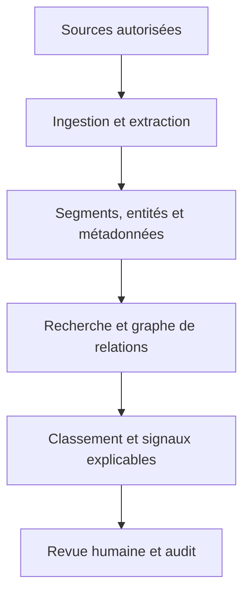

# Mass Classification

**Plateforme de classification et d’exploration de données à grande échelle, pensée pour l’analyse de transactions bancaires et de dossiers d’enquête.**

Mass Classification transforme des fichiers et des flux hétérogènes en informations consultables : documents classés, entités repérées, relations rattachées à leurs sources, passages retrouvables et pistes à examiner. L’objectif est d’aider un analyste à **retrouver, comprendre et vérifier** l’information dans un ensemble de pièces volumineux.

> **État du dépôt :** l’application et son mode découverte sont disponibles sur la branche [`feature/platform-production-foundation`](https://github.com/Matt95354855/Mass_Classification/tree/feature/platform-production-foundation). Sa [pull request vers `main`](https://github.com/Matt95354855/Mass_Classification/pull/1) est ouverte. Le mode découverte fonctionne sans compte, Docker ni modèle à télécharger.

## Essayer l’application

Cloner le dépôt, installer les dépendances légères de découverte et lancer le serveur :

```bash
git clone --branch feature/platform-production-foundation --single-branch https://github.com/Matt95354855/Mass_Classification.git
cd Mass_Classification
python -m pip install -r requirements-demo.txt
python -m mass_classification.demo
```

Ouvrir **http://127.0.0.1:8000/**. Trois documents fictifs apparaissent immédiatement. Essayez de rechercher `virement Nova`, ouvrez une pièce, examinez les relations et enregistrez une revue. Un fichier texte UTF-8 peut également être importé. Le serveur reste accessible uniquement depuis la machine locale ; les données de cet essai sont conservées dans `.mass-demo/`.

Le mode découverte utilise une recherche textuelle et des règles simples. Pour exécuter le traitement complet (OCR, embeddings, PostgreSQL, modèles et worker), suivre les [instructions Docker sur la branche de l’application](https://github.com/Matt95354855/Mass_Classification/blob/feature/platform-production-foundation/docs/README_TECHNIQUE.md#démarrage).

## Pourquoi ce projet ?

Dans une enquête financière ou documentaire, l’information arrive sous des formes différentes : lignes de transactions, relevés, courriels, PDF, images, enregistrements et données structurées. Les volumes rendent difficile la lecture exhaustive et les liens utiles se perdent entre les pièces.

La plateforme vise à répondre à quatre besoins :

1. **Rassembler** les données autorisées dans un espace de travail contrôlé.
2. **Structurer** le contenu en textes, entités, dates, montants et relations documentées.
3. **Retrouver** les passages pertinents et expliquer d’où vient chaque résultat.
4. **Faire examiner** les pistes et les corrections par une personne responsable du dossier.

### Exemples d’utilisation

| Situation | Ce que la plateforme aide à faire | Ce qu’elle ne conclut pas seule |
| --- | --- | --- |
| Des milliers de transactions et de justificatifs | Retrouver des montants, classer les pièces et relier les références présentes dans les documents | Qu’une transaction est frauduleuse |
| Un dossier contenant courriels, PDF et captures d’écran | Rechercher un nom ou un événement dans plusieurs formats et ouvrir le passage source | Que deux personnes ont réellement une relation parce qu’elles apparaissent dans une même pièce |
| Des publications et événements horodatés provenant d’une source autorisée | Comparer leur contenu et leur chronologie pour orienter une revue | Qu’une campagne coordonnée ou une intention est prouvée |

## Comment fonctionne l’analyse ?



**1. Ingestion.** Les fichiers sont reçus par API ou par connecteur. Leur empreinte permet de retrouver les doublons dans un même espace de travail. Le traitement se poursuit en arrière-plan.

**2. Extraction.** Le texte est extrait de formats courants. L’OCR traite les images et certains PDF scannés ; les composants audio et vidéo utilisent une transcription locale quand ils sont configurés.

**3. Indexation.** Les documents sont découpés en passages. Un modèle d’embeddings multilingues permet de rechercher par sens, en plus des métadonnées conservées avec la pièce.

**4. Analyse.** Des règles et outils NLP repèrent des entités, montants et relations avec leur passage justificatif. Un graphe aide à explorer ces liens. Des calculs topologiques et une architecture de réseau neuronal topologique sont prévus pour des cas validés par des données annotées.

**5. Restitution.** L’API et la console présentent les résultats, les pièces sources, les exports et les décisions de revue. La question-réponse actuelle restitue des extraits cités ; elle ne rédige pas une synthèse libre sans preuve.

## Principes du projet

- **Traçabilité :** un résultat utile doit pointer vers une pièce et, si possible, vers un passage précis.
- **Séparation des dossiers :** clés d’accès, rôles et filtrage des données par espace de travail (`tenant`).
- **Contrôle humain :** les signaux orientent la lecture ; ils ne prononcent ni culpabilité, ni fraude, ni crédibilité.
- **Déploiement maîtrisé :** services Python, PostgreSQL/pgvector et Redis, avec stockage et modèles sous le contrôle de l’exploitant.
- **Progression mesurée :** les performances, la qualité des modèles et la capacité à traiter des millions de pièces doivent être testées sur les données et l’infrastructure visées.

## Où trouver l’implémentation ?

| Ressource | Contenu |
| --- | --- |
| [Guide technique](https://github.com/Matt95354855/Mass_Classification/blob/feature/platform-production-foundation/docs/README_TECHNIQUE.md) | Installation, API, connecteurs, modèles, exploitation et limites détaillées |
| [Code Python](https://github.com/Matt95354855/Mass_Classification/tree/feature/platform-production-foundation/mass_classification) | API, worker, extraction, analyse, topologie et interface |
| [Mode découverte](https://github.com/Matt95354855/Mass_Classification/blob/feature/platform-production-foundation/mass_classification/demo.py) | Serveur local et pièces synthétiques pour essayer le parcours utilisateur |
| [Guide de conception fourni](https://github.com/Matt95354855/Mass_Classification/blob/feature/platform-production-foundation/docs/GUIDE_CONSTRUCTION_PLATEFORME_COMPLETE.md) | Texte de référence ayant servi à définir le périmètre ; il est conservé pour la traçabilité |

Le guide de conception et le README technique ont des rôles différents : le premier expose des pistes et hypothèses, le second décrit le comportement du code et ses limites.

## Niveau de maturité

La branche de l’application contient une première architecture testée en CI : ingestion, extraction, recherche, relations sourcées, API, interface, journal d’audit et conteneur Docker. Elle n’a **pas** fait l’objet d’une validation de bout en bout sur une infrastructure bancaire ou policière réelle.

Avant toute utilisation sensible, il faut notamment fournir les jeux de données annotés, vérifier les modèles et leurs erreurs, tester l’isolation et les sauvegardes, mesurer la charge, configurer TLS et les secrets, et définir les règles de conservation des données. Si aucun modèle topologique approuvé n’est installé, l’API indique que sa prédiction est indisponible.

## Participer

Les propositions sont bienvenues lorsqu’elles ajoutent des tests reproductibles et expliquent la provenance des données utilisées. Ne publiez pas de transactions réelles, dossiers d’enquête, clés d’accès ou modèles non autorisés dans le dépôt.
