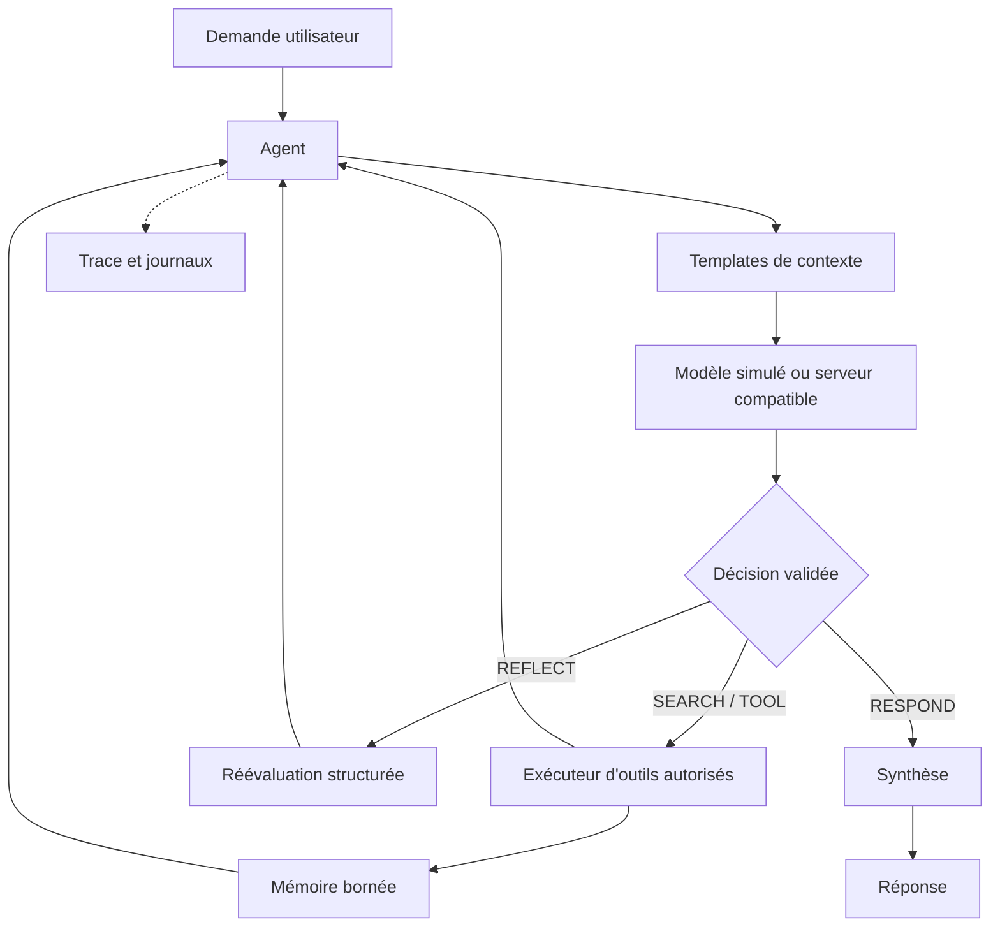

# Harness

**Un moteur d'exécution TypeScript pour construire, observer et tester des agents IA, prêt à être relié à un modèle local.**

[](https://github.com/Matt95354855/Harness/actions/workflows/ci.yml)


Harness prend une demande, choisit une action, exécute les outils autorisés, conserve les résultats utiles et produit une réponse. Chaque exécution dispose de limites explicites et d'une trace structurée pour comprendre ce qui s'est passé.

Le projet démarre avec un modèle simulé et des résultats de recherche de démonstration. **Aucune clé API ni aucun téléchargement de modèle n'est nécessaire pour le tester.** Les fixtures sont identifiées comme telles : elles ne constituent pas une recherche web en direct.

## Démarrage rapide

Prérequis : **Node.js 22.13 ou plus récent**, avec npm. La CI couvre Node.js 22 et 24.

```bash
git clone https://github.com/Matt95354855/Harness.git
cd Harness
npm ci
npm run demo
```

La démonstration fait fonctionner le harness de bout en bout : décision, outil de recherche simulée et synthèse. L'installation des dépendances nécessite une connexion ; la démonstration et les tests fonctionnent ensuite sans fournisseur externe.

```bash
# Vérifier la configuration
npm run doctor

# Poser une question avec le fournisseur configuré
npm run dev -- run "Explique le rôle d'un agent harness."

# Ouvrir une conversation
npm run dev -- chat

# Obtenir une sortie exploitable par un programme
npm run demo -- --json

# Exécuter les contrôles du projet
npm run check
```

Le mode `mock` suit des scénarios déterministes. Il permet de vérifier l'orchestration ; il ne mesure pas l'intelligence d'un modèle et ne répond pas librement à toutes les questions.

## Ce que le projet fournit

| Fonction | Comportement |
| --- | --- |
| Boucle d'agent | Actions `SEARCH`, `TOOL`, `REFLECT` et `RESPOND`, avec validation des décisions. |
| Client de modèle | Fournisseur simulé et client HTTP compatible avec `/v1/chat/completions`. |
| Outils extensibles | Registre typé, validation des paramètres, liste d'autorisation et délai maximal. |
| Recherche | Fixtures hors ligne, endpoint JSON configurable et adaptateur SearXNG. |
| Mémoire | Conversations, faits avec expiration, décisions et statistiques d'utilisation. |
| Observabilité | Traces JSON par exécution, métriques de jetons et journaux structurés. |
| Limites d'exécution | Plafonds d'itérations, d'appels d'outils, de contexte et de durée ; annulation. |
| Validation | Tests unitaires et d'intégration, exemples reproductibles, benchmark hors ligne et CI. |

Les traces contiennent des actions et de courts résumés observables. Le harness ne demande pas au modèle de révéler sa chaîne de pensée privée.

## Fonctionnement



Le modèle propose une action ; le harness en contrôle l'exécution. Les sorties d'outils sont traitées comme des données non fiables. Les outils s'exécutent dans le processus Node.js : les limites applicatives ne remplacent pas une isolation système. Voir [Sécurité](SECURITY.md).

## Configuration

```bash
cp .env.example .env
npm run doctor
```

Les réglages et leurs valeurs par défaut figurent dans [`.env.example`](.env.example). Le fichier `.env` est ignoré par Git. Les variables déjà présentes dans l'environnement ont priorité.

Pour relier ultérieurement un serveur local compatible :

```dotenv
LLM_PROVIDER=openai-compatible
LLM_ENDPOINT=http://127.0.0.1:11434/v1
LLM_MODEL=nom-exact-du-modele-installe
LLM_API_KEY=
SEARCH_PROVIDER=none
```

Le modèle doit savoir produire les décisions JSON attendues par le harness. Un endpoint compatible ne garantit pas que chaque modèle suivra ce protocole correctement. Le [guide du modèle local](docs/local-model.md) décrit le raccordement à Ollama ou LM Studio et la procédure de validation.

Le modèle et la recherche sont configurés séparément. Utiliser un LLM local ne rend pas automatiquement la recherche privée ou hors ligne.

## API TypeScript

Exemple depuis un fichier placé à la racine du dépôt :

```typescript
import { Agent } from './src/index.js';

const agent = new Agent({
  name: 'ResearchBot',
  maxIterations: 8,
  maxToolCalls: 4,
});

const answer = await agent.process('Explique le rôle des outils.');
console.log(answer);
console.log(agent.getTrace());
```

`process()` renvoie la réponse et rejette sa promesse en cas d'échec. Les limites atteintes, annulations et erreurs restent visibles dans la trace. Les dépendances sont injectables pour tester un scénario ou fournir son propre modèle, registre d'outils, logger et mémoire.

Voir [l'API publique](docs/api.md) pour ajouter un outil, choisir un fournisseur et gérer une annulation.

## Exemples et qualité

La validation initiale comprend **88 tests réussis** et **98,16 % de couverture des lignes**. Le [rapport de validation](docs/validation.md) précise l'environnement, les mesures et ce qui reste à vérifier avec un vrai modèle.

```bash
npm run example:basic
npm run example:multi-hop
npm run example:advanced
npm run test:coverage
npm run benchmark
```

| Commande | Objectif |
| --- | --- |
| `npm run check` | Analyse statique, typage, tests et compilation. |
| `npm test` | Tests unitaires et d'intégration sans modèle externe. |
| `npm run test:coverage` | Rapport de couverture et fichier LCOV. |
| `npm run build` | Compilation ESM et déclarations TypeScript dans `dist/`. |
| `npm start -- run "Bonjour"` | Exécution de la version compilée. |
| `npm run benchmark` | Mesure locale de l'orchestration avec un modèle simulé. |

Les tests HTTP utilisent des doubles contrôlés et un serveur de test sur `127.0.0.1` pour vérifier les requêtes, les erreurs et la gestion des réponses. Ils ne certifient pas un fournisseur distant. Les benchmarks simulés ne mesurent ni la vitesse d'inférence ni la qualité d'un LLM réel.

## Structure du dépôt

```text
src/
├── core/          # Configuration, contrats et orchestration
├── models/        # Client LLM, simulation et templates
├── hermes/        # Décision et réflexion structurées
├── tools/         # Recherche, registre et exécuteur
├── memory/        # Conversation et traces
├── utils/         # Journaux et parsing
├── cli.ts         # Interface en ligne de commande
└── index.ts       # Exports publics
examples/          # Scénarios exécutables
tests/             # Tests unitaires et d'intégration
scripts/           # Benchmark
docs/              # Architecture, API et guide local
```

## Choix d'implémentation

Le cahier des charges initial décrit correctement les besoins d'un harness, mais attribue à certains projets des interfaces non établies. Cette implémentation remplit les fonctions attendues avec des composants explicites :

- **Templates de prompts** : moteur local `PrismAdapter`, sans dépendance à un SDK PrismML de templating.
- **Décision et réflexion** : moteur propre au dépôt ; les noms de fichiers historiques `hermes/` ne désignent pas une intégration officielle de Hermes Agent.
- **Recherche** : fournisseurs configurables et SearXNG, sans supposer l'existence d'une API de recherche `api.pi.dev`.

Les correspondances, corrections et critères des **14 phases** sont détaillés dans le [suivi d'implémentation](docs/implementation-status.md).

## Documentation et contribution

- [Architecture et limites](docs/architecture.md)
- [API publique](docs/api.md)
- [Catalogue des outils](docs/tools.md)
- [Brancher un modèle local](docs/local-model.md)
- [Suivi des 14 phases](docs/implementation-status.md)
- [Rapport de validation initiale](docs/validation.md)
- [Contribuer](CONTRIBUTING.md)
- [Sécurité et traitement des données](SECURITY.md)

Le projet est en version initiale : l'API peut encore évoluer. Aucune licence de redistribution n'a été choisie ; le dépôt n'accorde donc pas de licence open source pour le moment. Le paquet est marqué `private` pour empêcher sa publication accidentelle sur npm.
