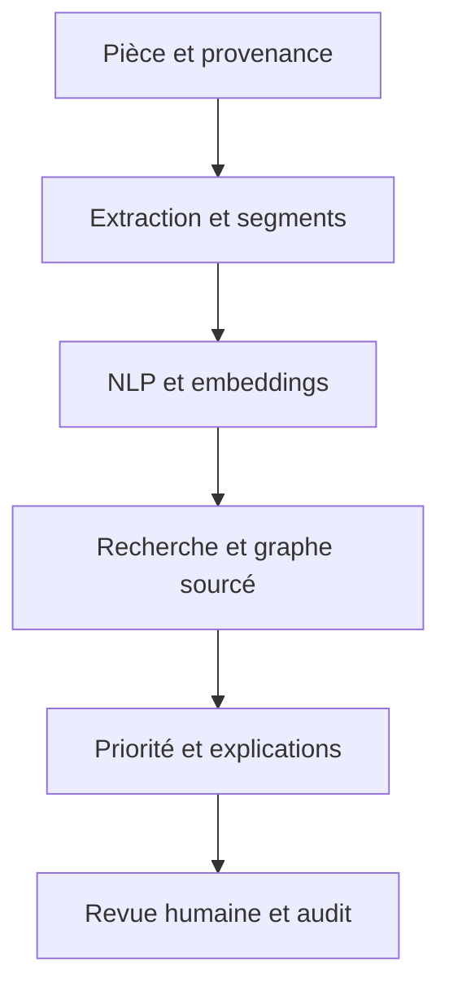

# Mass Classification

**Une plateforme Python pour importer, classer et explorer des pièces documentaires avec leur provenance.** Elle s’adresse à l’analyse de dossiers financiers et d’enquête : les documents deviennent recherchables, les relations entre entités renvoient à des passages sources, et les analystes consignent leur revue. Les scores servent à organiser le travail ; ils ne prouvent ni fraude, ni intention, ni crédibilité.

> **Où se trouve l’application ?** Le code, l’interface et le mode découverte sont sur la branche [`feature/platform-production-foundation`](https://github.com/Matt95354855/Mass_Classification/tree/feature/platform-production-foundation). La [pull request vers `main`](https://github.com/Matt95354855/Mass_Classification/pull/1) est ouverte. Le présent README donne le parcours utilisateur et la vue d’ensemble ; le [guide technique](https://github.com/Matt95354855/Mass_Classification/blob/feature/platform-production-foundation/docs/README_TECHNIQUE.md) détaille les commandes d’exploitation et les limites de chaque composant.


## Essayer l’interface en quelques minutes

**Pré-requis :** Python 3.11 ou plus récent. Le mode découverte ne demande ni compte, ni Docker, ni téléchargement de modèle. Les trois pièces initiales sont fictives.

```bash
git clone --branch feature/platform-production-foundation --single-branch https://github.com/Matt95354855/Mass_Classification.git
cd Mass_Classification
python -m venv .venv
source .venv/bin/activate                 # Windows : .venv\Scripts\activate
python -m pip install -r requirements-demo.txt
python -m mass_classification.demo
```

Ouvrir **http://127.0.0.1:8000/**, puis :

1. Rechercher `virement Nova` et ouvrir un passage retrouvé pour vérifier sa pièce.
2. Consulter **Relations** et **Chronologie** : les liens proviennent de passages, les dates déclarées par la source sont distinguées des dates d’import.
3. Ouvrir une pièce, regarder la priorité et ses contributions, puis enregistrer une revue.
4. Importer, si souhaité, un fichier UTF-8 `.txt`, `.md`, `.csv`, `.tsv`, `.json` ou `.eml` de **5 Mio maximum** ; exporter ensuite un inventaire CSV ou un rapport PDF.

Le serveur d’essai écoute sur `127.0.0.1`. Ses imports et revues sont enregistrés dans `.mass-demo/` sur votre machine. Pour repartir de zéro, arrêter le serveur puis supprimer ce dossier **en sachant que cela efface aussi vos imports et revues locaux**. Pour changer de port : `python -m mass_classification.demo --port 8080`.

Le mode découverte réalise une **recherche lexicale** et une analyse par règles. Il n’exécute pas l’OCR, la transcription, les embeddings multilingues ou le réseau neuronal de la plateforme complète. Sa bannière le rappelle dans l’interface.

## Comprendre les deux modes

| | Découverte locale | Service complet |
| --- | --- | --- |
| Mise en route | Python et `requirements-demo.txt` | Docker Compose, PostgreSQL/pgvector, Redis, volumes et modèles |
| Accès | Sans authentification, sur la machine locale | Clés API par espace de travail et rôles `admin`, `analyst`, `reader` |
| Données | Trois exemples fictifs et fichiers texte importés localement | Fichiers texte, documents, images, audio et vidéo selon les extracteurs |
| Recherche | Correspondance lexicale des passages | Embeddings multilingues, segments et recherche vectorielle |
| Traitement | Immédiat pour les petits fichiers autorisés | Worker avec tâches persistantes, baux et tentatives de reprise |
| Résultats | Règles simplifiées et preuves consultables | NLP, règles, graphe, topologie ; prédictions TNN uniquement avec poids approuvés |

### Démarrer le service complet

Créer `.env` à partir de l’exemple et **remplacer** `POSTGRES_PASSWORD` ainsi que le mot de passe dans `DATABASE_URL` par la même valeur. Configurer `ALLOWED_ORIGINS` selon votre domaine. Le premier lancement peut télécharger des modèles : prévoir le temps et l’espace disque nécessaires, ou les précharger pour un environnement isolé.

```bash
cp .env.example .env
# Modifier .env et conserver les secrets hors du dépôt.
docker compose build
docker compose up -d db redis
docker compose run --rm api python -m mass_classification.admin create-key --tenant default --role admin
# Conserver la clé mc_... affichée une seule fois dans un coffre de secrets.
docker compose up -d api worker
curl http://127.0.0.1:8000/health/ready
```

L’interface est à **http://127.0.0.1:8000/** et la documentation interactive de l’API à `/docs`. Compose lie l’API à la boucle locale ; pour un accès réseau, l’exploitant doit fournir HTTPS, authentification réseau et stockage adapté. L’exemple ci-dessous nécessite un fichier `exemple.txt` existant :

```bash
export MASS_API_KEY='mc_...'
curl -H "Authorization: Bearer $MASS_API_KEY" \
  -F file=@exemple.txt \
  -F 'source_json={"case":"D-17","event_at":"2026-04-14T10:30:00+02:00"}' \
  http://127.0.0.1:8000/v1/documents
curl -H "Authorization: Bearer $MASS_API_KEY" http://127.0.0.1:8000/v1/documents
curl -H "Authorization: Bearer $MASS_API_KEY" \
  -H 'Content-Type: application/json' -d '{"query":"virement inhabituel"}' \
  http://127.0.0.1:8000/v1/ask
```

L’import répond `202`. La pièce passe par `queued`, `processing`, puis `ready` ou `failed`. Une pièce identique dans le même espace renvoie son identifiant existant. Le service de questions-réponses restitue des extraits et leurs références : il ne génère pas de conclusion libre.

## Du fichier à la revue



- **Ingestion.** L’API borne la taille des fichiers, calcule leur empreinte SHA-256, détecte les doublons dans l’espace de travail et confie le traitement à un worker.
- **Extraction.** Selon le format, le worker récupère le texte de documents structurés ou de courriels, effectue de l’OCR pour certaines images et PDF, et peut transcrire audio et vidéo. Une extraction impossible est signalée ; aucun texte n’est inventé.
- **Indexation.** Les passages sont stockés dans PostgreSQL avec des vecteurs multilingues de 384 dimensions. Un modèle d’embeddings adapté peut être entraîné et réindexé séparément pour un espace de travail.
- **Analyse.** Des règles et outils NLP détectent langue, entités, montants et relations explicites avec leur extrait justificatif. Le graphe et ses caractéristiques topologiques décrivent des liens *extraits*, à vérifier dans leur contexte.
- **Restitution.** La console rassemble documents, recherche, carte des relations, chronologie, contributions du score, revues et exports. Les actions sont enregistrées dans un journal vérifiable pour les nouveaux événements.

### Ce qui est disponible et ce qui reste conditionnel

| Domaine | Capacité dans le dépôt | Condition ou limite |
| --- | --- | --- |
| Classification | Priorité par règles et architecture TNN avec attention multi-tête, têtes de classes et score | Le TNN ne prédit rien sans checkpoint entraîné et approuvé ; aucun score n’est une probabilité de fraude validée |
| Explications | Termes repérés, contributions par règles et SHAP exact sur la priorité `rules:v1` en mode complet | SHAP explique le calcul de cette règle, pas une cause ni le TNN |
| Graphe et temps | Relations sourcées, homologie persistante bornée, chronologie avec provenance des dates | Noms similaires seulement proposés ; fusion par administrateur après vérification ; date d’import étiquetée séparément |
| Recherche et échanges | Recherche vectorielle et réponse par extraits cités dans le service complet | La qualité dépend des données et du modèle ; pas de synthèse générative ni de vérification automatique des faits |
| Flux et médias | Connecteurs fichiers, RSS, S3, SQL, MongoDB, SFTP et Kafka ; extraction images, audio et vidéo | Sources et permissions à configurer ; worker et rafraîchissement régulier sans garantie de latence temps réel |
| Déploiement | Compose, manifestes Kubernetes de référence, option CUDA, métriques et vérification du journal | GPU, cluster, stockage partagé, secrets, TLS et ancrage externe d’audit à fournir et à tester |
| Mobilité et hors ligne | Console responsive, PWA et page d’exemple fictif accessible hors ligne | Pas d’application native ; aucun dossier sensible, résultat API ou document réel dans le cache hors ligne |

Le [guide technique](https://github.com/Matt95354855/Mass_Classification/blob/feature/platform-production-foundation/docs/README_TECHNIQUE.md#extensions-should-have-et-nice-to-have) reprend **chaque point Should Have et Nice to Have** du document de conception, avec son état précis. Le [guide de conception initial](https://github.com/Matt95354855/Mass_Classification/blob/feature/platform-production-foundation/docs/GUIDE_CONSTRUCTION_PLATEFORME_COMPLETE.md) contient aussi des idées et des hypothèses qui ne doivent pas être confondues avec une capacité mesurée du code.

## API, accès et traçabilité

| Action | Route principale | Accès |
| --- | --- | --- |
| Déposer et suivre une pièce | `POST /v1/documents`, `GET /v1/documents` | Écriture : admin ou analyst ; lecture : tout rôle du même espace |
| Lire l’analyse et l’explication | `GET /v1/documents/{id}`, `GET /v1/documents/{id}/explanation` | Tout rôle du même espace |
| Retrouver des passages | `POST /v1/search`, `POST /v1/ask` | Tout rôle du même espace |
| Explorer les liens et dates | `GET /v1/graph`, `GET /v1/timeline` | Tout rôle du même espace |
| Examiner les doublons d’entités | `GET /v1/entities/candidates`, `POST /v1/entities/merge` | Suggestions : admin/analyst ; fusion : admin |
| Consigner une revue et exporter | `POST /v1/documents/{id}/feedback`, routes `/v1/exports` et `/report.pdf` | Admin ou analyst |
| Auditer et surveiller | `GET /v1/audit`, `GET /v1/audit/verify`, `GET /v1/monitoring`, `/metrics` | Admin |

Les clés sont liées à un espace (`tenant`) et à un rôle. Les requêtes applicatives filtrent les données par espace ; Redis limite les appels par clé. Le journal associe les **nouveaux** événements à une chaîne SHA-256 par espace. La route de vérification détecte certaines altérations, mais un administrateur de base de données pourrait réécrire toute la chaîne : exporter périodiquement son empreinte finale vers un support externe si cette menace doit être couverte. Les événements antérieurs à la migration sont signalés séparément.

## Vérifier et contribuer

```bash
python -m pip install -e '.[test,topology]'
python -m compileall -q mass_classification
python -m pytest -q
```

La CI exécute les tests et construit l’image Docker. Les tests couvrent notamment l’essai local, la provenance des dates, les suggestions d’entités, les règles et des invariants d’audit. La validation de bout en bout avec PostgreSQL, Redis, médias réels et charge de production nécessite une infrastructure représentative. Le [guide technique](https://github.com/Matt95354855/Mass_Classification/blob/feature/platform-production-foundation/docs/README_TECHNIQUE.md) décrit les modèles, la réindexation par espace, les commandes d’exploitation et les limites.

**Avant tout usage sensible**, constituer des jeux annotés, évaluer les erreurs des modèles, tester les droits entre espaces, les restaurations et la montée en charge, définir la conservation des pièces, puis configurer secrets, chiffrement et TLS. Les coûts, latences et volumes envisagés dans le guide de conception sont des objectifs à mesurer, pas des résultats acquis.

Voir [LICENSE](https://github.com/Matt95354855/Mass_Classification/blob/feature/platform-production-foundation/LICENSE) pour la licence. Ne publier ni données bancaires réelles, ni dossiers d’enquête, ni clés d’accès dans les contributions.
