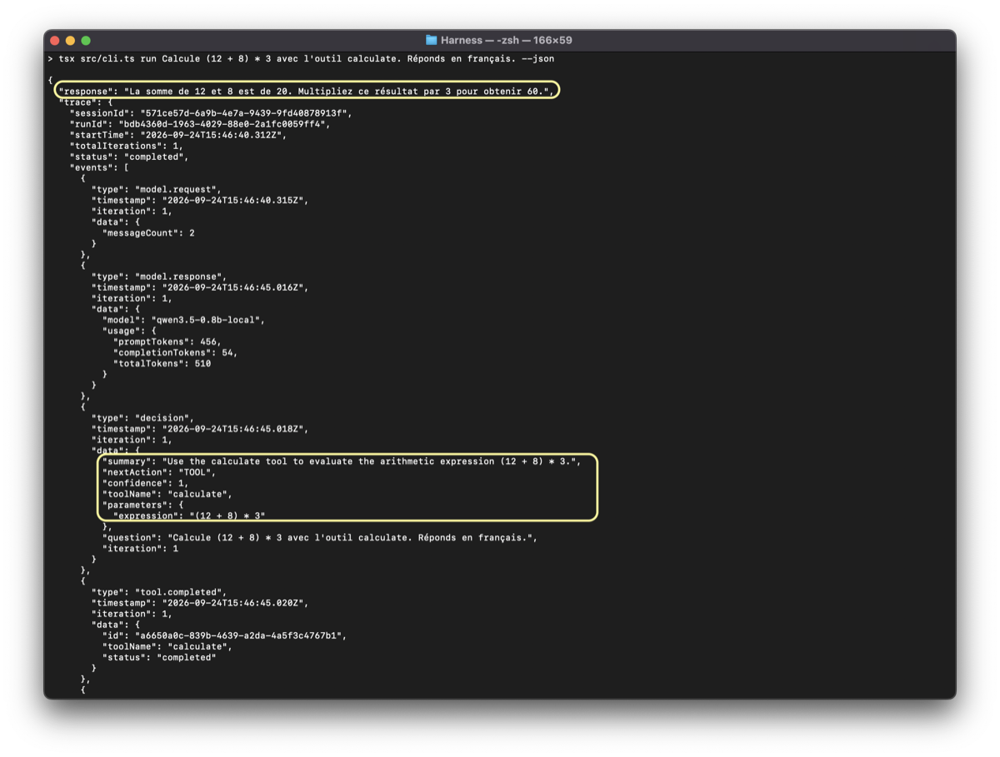
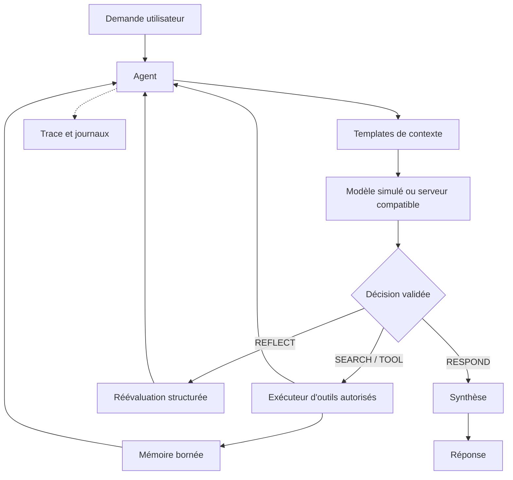

# Classcale Unified Platform


> **Campagne locale du 1 octobre 2026 :** GPT-OSS 20B MXFP4 atteint 82,76 % d’accuracy et 66,85 % de Macro-F1 sur 20 pages DocLayNet ; Qwen 3.6 27B Instruct Q4_K_M atteint 78,82 % et 56,48 %. Voir le [rapport complet](docs/doclaynet-benchmark-2026-10-01.md).

Le Harness est le moteur TypeScript qui orchestre les modèles de langage, les outils et les services de classification documentaire. Il fournit une boucle d’agent contrôlée, des connecteurs MCP, des traces structurées, une interface web locale et un banc d’évaluation reproductible pour DocLayNet.

Les modèles locaux sont servis via `llama.cpp` au format OpenAI-compatible. Les outils sont explicitement autorisés, bornés et observables ; aucune connexion externe n’est activée par défaut.

**Une plateforme unifiée qui réunit un harness d'agents IA TypeScript et le service Python Mass Classification dans un même dépôt.**

Le harness orchestre les modèles, les outils, la mémoire et les traces. Mass Classification, conservé dans [`services/mass-classification`](services/mass-classification), fournit l'ingestion documentaire, l'extraction multimodale, la classification explicable, la recherche, le graphe et les modèles topologiques conditionnés à des poids approuvés.

Le raccordement HTTP et le profilage des documents sont implémentés et testés avec les services réels. Le parcours de production accepte les **PDF et DOCX contenant du texte, des images et des tableaux**. L'OCR précède l'extraction native ; les résultats conservent leurs sources et leur profil d'entrée.

La plateforme unifiée est intégrée à `main`. Le contrat de résultat v1, le routage déterministe, les garde-fous et l'outillage d'évaluation sont disponibles. L'adaptation selon la qualité et l'abstention calibrée restent à construire.

## Avancement de la plateforme

| Étape | État | Livraison |
| --- | --- | --- |
| 0 — Unification | Fusionnée dans `main` | Deux historiques conservés, service Python intégré, CI commune |
| 1 — Contrat de résultat | Implémenté, version 1 | Statuts métier et schéma JSON : [contrat de résultat](docs/classification-result.md) |
| 2 — Capacités | Implémentée | Route authentifiée `/v1/capabilities`, périmètre PDF/DOCX, ordre OCR puis extraction native |
| 3 — Adaptateur | Implémentée et testée de bout en bout | Envoi multipart, suivi, analyse, preuves, feedback explicitement activable |
| 4 — Profilage | Implémentée et testée de bout en bout | Signature, taille, SHA-256 ; structure inspectée par le worker avant OCR |
| 5 — Routage | Première version déterministe | Plan PDF ou DOCX persisté avant OCR ; blocage si OCR indisponible ; adaptation avancée à poursuivre |
| 6 — Fusion et garde-fous | Politique conservatrice implémentée | Contributions séparées, désaccords, rejet des scores invalides et revue humaine ; [limites de calibration](docs/classification-fusion.md) |
| 7 — Évaluation métier | Outillage implémenté, corpus métier requis | Rapports reproductibles, précision/rappel/F1, abstention, contrôles de partitions et diagnostics neuronaux ; [guide d'évaluation](docs/classification-evaluation.md) |

Le [guide de la plateforme](docs/unified-platform.md) détaille les comportements et limites. Le [guide de démarrage documentaire](docs/document-workflow.md) fournit la configuration et un exemple exécutable.

## Validation du parcours documentaire

La recette utilise PostgreSQL/pgvector, Redis, l'API, le worker, Tesseract et les embeddings réels. Les PDF/DOCX synthétiques contiennent texte natif, image et tableau. Elle vérifie le profil, l'OCR, la classification par règles, la déduplication, le feedback, la recherche vectorielle et le refus d'accès sans clé.

- **98 tests Harness** et **10 tests Python ciblés** réussis lors de l'étape 4.
- [Parcours réel avec profilage : réussi en 2 min 28 s](https://github.com/Matt95354855/Harness/actions/runs/36142880989).
- Le [rapport de validation documentaire](docs/document-validation.md) distingue cette preuve des tests historiques et des validations restantes.
- Étape 6 : 98 tests Harness et 36 tests Python ciblés réussis ; [parcours réel avec garde-fous réussi](https://github.com/Matt95354855/Harness/actions/runs/36535694357). Détails dans le [bilan de fusion](docs/classification-fusion.md).
- Étape 7 : 98 tests Harness et 56 tests Python ciblés réussis ; [parcours réel avec rapport d'évaluation réussi](https://github.com/Matt95354855/Harness/actions/runs/36589037305). Deux documents synthétiques correctement classés ne constituent pas une mesure de précision métier.

La recette pilote directement l'adaptateur ; elle n'évalue pas le choix autonome des outils par un LLM, la précision d'un TNN entraîné ou la charge de production.

## Composants

| Composant | Technologie | Responsabilité |
| --- | --- | --- |
| Harness | TypeScript / Node.js | Orchestration, outils, politiques d'exécution, mémoire et traçabilité |
| Mass Classification | Python / FastAPI | Ingestion, extraction, indexation, classification et preuves |

Les historiques Git des deux projets sont conservés. Le service Python reste également disponible dans son dépôt d'origine ; les évolutions communes sont désormais réalisées depuis ce monorepo.

## Harness

**Un moteur d'exécution TypeScript pour construire, connecter, observer et tester des agents IA, avec une configuration locale prête pour Qwen3.5 et `llama.cpp`.**

Le harness peut relier un LLM local à des serveurs MCP, GitHub, des dossiers locaux autorisés, Google Drive et Internet. Chaque connexion reste désactivée par défaut et ne se charge que lorsqu'elle est explicitement configurée et autorisée.

[](https://github.com/Matt95354855/Harness/actions/workflows/ci.yml)


Harness prend une demande, choisit une action, exécute les outils autorisés, conserve les résultats utiles et produit une réponse. Chaque exécution dispose de limites explicites et d'une trace structurée pour comprendre ce qui s'est passé.

Le projet démarre avec un modèle simulé et des résultats de recherche de démonstration. **Aucune clé API ni aucun téléchargement de modèle n'est nécessaire pour le tester.** Les fixtures sont identifiées comme telles : elles ne constituent pas une recherche web en direct.

## Capacités connectées

Harness transforme un modèle de langage en agent capable d'utiliser des services externes à travers une couche d'exécution contrôlée :

- **Model Context Protocol** : connexion aux serveurs MCP distants en Streamable HTTP et aux serveurs locaux en `stdio`, découverte de leurs outils et intégration automatique dans le registre du Harness ;
- **GitHub** : accès au serveur MCP officiel pour consulter les dépôts, fichiers, commits, branches, issues, pull requests, versions et résultats de recherche, avec une configuration en lecture seule fournie par défaut ;
- **fichiers locaux** : exploration de dossiers autorisés, lecture de fichiers texte et recherche de contenu sans accès global au système de fichiers ;
- **Google Drive** : recherche de documents et lecture de contenus textuels avec une autorisation OAuth limitée à la lecture ;
- **Internet** : recherche via un fournisseur HTTP ou SearXNG et lecture directe de pages publiques avec validation des URL, contrôle des redirections et limites de taille ;
- **sélection des capacités** : `ALLOWED_TOOLS` limite les outils disponibles et empêche le chargement des connexions qui ne sont pas nécessaires à la demande ;
- **traçabilité** : chaque décision, appel d'outil, résultat, erreur et consommation déclarée de jetons reste visible dans la trace d'exécution.

Les connecteurs manipulent les données externes comme des contenus non fiables. Les permissions, délais, tailles maximales et listes d'autorisation restent appliqués avant que les résultats soient transmis au modèle.

## État de validation publique

La recette d'acceptation du 25 septembre 2026 a été exécutée avec **Qwen3.5 0.8B Q8_0 sur CPU**, à partir de données publiques ou non sensibles. Elle produit une preuve compacte à partir des traces réelles, sans publier de jeton ni de contenu personnel.

| Statut observé | Scénario | Preuve obtenue |
| --- | --- | --- |
| Réussi | Calcul déterministe | Résultat `60` retourné par `calculate` |
| Réussi | Liste de fichiers locaux | `package.json` retrouvé dans la racine autorisée |
| À stabiliser | Lecture d'un fichier local | Une décision structurée invalide a été produite par le modèle avant l'appel d'outil |
| Réussi | Recherche dans les fichiers | `mcp-client.ts` retrouvé par `local_search` |
| Réussi | Lecture d'Internet | `Example Domain` récupéré par `web_fetch` |
| Réussi | GitHub par MCP | Dépôt public `Matt95354855/agent-harness` consulté |
| Non configuré | Recherche Internet générale | Fournisseur de recherche et endpoint encore absents |
| Non configuré | Google Drive | Autorisation OAuth de lecture encore absente |

Ce résultat décrit une exécution précise : **5 scénarios réussis, 1 scénario à stabiliser et 2 connexions non configurées**. Il ne transforme pas un test ignoré en réussite et met en évidence la différence entre le fonctionnement du Harness et la fiabilité décisionnelle d'un très petit modèle. La procédure reproductible est décrite dans le [protocole de preuves publiques](docs/public-validation.md).

## Démarrage rapide

Prérequis : **Node.js 22.13 ou plus récent**, avec npm. La CI couvre Node.js 22 et 24.

```bash
git clone https://github.com/Matt95354855/Harness.git
cd Harness
npm ci
npm run demo
```

Le dépôt utilise désormais `main` pour la plateforme unifiée. Cette commande démarre la démonstration Harness ; pour le traitement PDF/DOCX avec OCR, suivre le [guide documentaire](docs/document-workflow.md).

La démonstration fait fonctionner le harness de bout en bout : décision, outil de recherche simulée et synthèse. L'installation des dépendances nécessite une connexion ; la démonstration et les tests fonctionnent ensuite sans fournisseur externe.

```bash
# Vérifier la configuration
npm run doctor

# Poser une question avec le fournisseur configuré
npm run dev -- run "Explique le rôle d'un agent harness."

# Ouvrir une conversation
npm run dev -- chat

# Obtenir une sortie exploitable par un programme
npm run demo -- --json

# Exécuter les contrôles du projet
npm run check

# Produire une preuve concise avec le modèle et les connexions configurés
GITHUB_TOKEN="$(gh auth token)" npm run acceptance
```

Le mode `mock` suit des scénarios déterministes. Il permet de vérifier l'orchestration ; il ne mesure pas l'intelligence d'un modèle et ne répond pas librement à toutes les questions.

### Modèle local historique — validation Mac Intel

La configuration testée utilise **Qwen3.5 0.8B Q8_0** avec `llama.cpp`. Le modèle occupe environ 795 Mo sur disque et fonctionne entièrement sur CPU.

Sur la machine de validation (Mac Intel Core i7, 16 Go de mémoire, sans GPU), le modèle a sélectionné l'outil `calculate`, transmis l'expression `(12 + 8) * 3`, puis exploité le résultat `60` dans sa réponse. Ce test valide la chaîne complète : décision structurée, exécution contrôlée de l'outil et synthèse finale.



```bash
# Terminal 1 : démarrer le serveur local après l'installation décrite dans le guide
npm run local:llm

# Terminal 2 : vérifier puis utiliser le harness
npm run doctor
npm run dev -- run "Calcule (12 + 8) * 3 avec l'outil calculate."
```

Le [guide du modèle local](docs/local-model.md) donne l'installation exacte, la configuration et les commandes de validation.

### Campagne actuelle Windows — GPT-OSS et Qwen

La campagne DocLayNet actuelle utilise Windows 11, un CPU AMD EPYC 9354 exposé avec 4 cœurs/8 threads, une NVIDIA RTX 2000 Ada Generation avec environ 4 Go dédiés exposés et 16 Go de RAM visibles. Les fichiers GGUF sont stockés localement :

```text
C:\Users\Shadow\Models\gguf\gpt-oss-20b-mxfp4\gpt-oss-20b-MXFP4.gguf
C:\Users\Shadow\Models\gguf\qwen3.6-27b-instruct-q4_k_m\qwen3.6-27b-instruct-Q4_K_M.gguf
```

Les modèles sont textuels : l’adaptateur envoie le texte extrait et la géométrie normalisée des objets, mais pas les pixels PNG. Ce résultat ne doit donc pas être présenté comme un benchmark vision multimodal.

Depuis PowerShell, utiliser `npm.cmd` si la stratégie d’exécution bloque `npm.ps1` :

```powershell
Set-Location "C:\Users\Shadow\Documents\ChatGPT\classcale on windows\harness"
npm.cmd run local:llm:qwen
```

Les commandes stables, les paramètres de reprise et l’analyse des erreurs sont documentés dans [`docs/doclaynet-adapter.md`](docs/doclaynet-adapter.md) et [`docs/doclaynet-benchmark-2026-10-01.md`](docs/doclaynet-benchmark-2026-10-01.md).

Pour une campagne courte, lancer les 500 pages aléatoires reproductibles avec une seule commande : `npm.cmd run doclaynet:sample`. Le seed est intégré et `--resume` permet de reprendre exactement le même échantillon après une interruption.

## Ce que le projet fournit

| Fonction | Comportement |
| --- | --- |
| Boucle d'agent | Actions `SEARCH`, `TOOL`, `REFLECT` et `RESPOND`, avec validation des décisions. |
| Client de modèle | Fournisseur simulé et client HTTP compatible avec `/v1/chat/completions`. |
| Connexions MCP | Serveurs distants en Streamable HTTP et serveurs locaux en `stdio`, avec découverte automatique des outils. |
| Applications | GitHub par MCP, fichiers locaux en lecture seule et Google Drive avec OAuth limité. |
| Internet | Recherche configurable et lecture sécurisée de pages Web publiques. |
| Outils extensibles | Registre typé, validation des paramètres, liste d'autorisation et délai maximal. |
| Recherche | Fixtures hors ligne, endpoint JSON configurable et adaptateur SearXNG. |
| Mémoire | Conversations, faits avec expiration, décisions et statistiques d'utilisation. |
| Observabilité | Traces JSON par exécution, métriques de jetons et journaux structurés. |
| Limites d'exécution | Plafonds d'itérations, d'appels d'outils, de contexte et de durée ; annulation. |
| Validation | Tests unitaires et d'intégration, exemples reproductibles, benchmark hors ligne et CI. |

Les traces contiennent des actions et de courts résumés observables. Le harness ne demande pas au modèle de révéler sa chaîne de pensée privée.

## Fonctionnement


```mermaid
flowchart TD
    U[Demande utilisateur] --> A[Agent]
    M[Mémoire bornée] --> A
    A --> P[Templates de contexte]
    P --> L[Modèle simulé ou serveur compatible]
    L --> D{Décision validée}
    D -->|SEARCH / TOOL| T[Exécuteur d'outils autorisés]
    T --> M
    T --> A
    D -->|REFLECT| R[Réévaluation structurée]
    R --> A
    D -->|RESPOND| S[Synthèse]
    S --> O[Réponse]
    A -.-> J[Trace et journaux]
```

Le modèle propose une action ; le harness en contrôle l'exécution. Les sorties d'outils sont traitées comme des données non fiables. Les outils s'exécutent dans le processus Node.js : les limites applicatives ne remplacent pas une isolation système. Voir [Sécurité](SECURITY.md).

## Configuration

```bash
cp .env.example .env
npm run doctor
```

Les réglages et leurs valeurs par défaut figurent dans [`.env.example`](.env.example). Le fichier `.env` est ignoré par Git. Les variables déjà présentes dans l'environnement ont priorité.

Pour activer les connexions demandées :

```dotenv
WEB_ACCESS=true
LOCAL_FILE_ROOTS=/Users/vous/Documents,/Users/vous/Projects
GOOGLE_DRIVE_ACCESS_TOKEN=votre_jeton_oauth_drive_readonly
GITHUB_TOKEN=github_pat_votre_jeton
MCP_CONFIG_PATH=.harness/mcp.json
```

Copier ensuite [`config/mcp.example.json`](config/mcp.example.json) vers `.harness/mcp.json`. L'exemple utilise le serveur MCP officiel GitHub en lecture seule. `npm run doctor` affiche les connexions actives et les outils réellement disponibles. Le [guide des connexions](docs/connections.md) explique les autorisations, limites et étapes de configuration.

Pour relier un serveur local compatible :

```dotenv
LLM_PROVIDER=openai-compatible
LLM_ENDPOINT=http://127.0.0.1:11434/v1
LLM_MODEL=nom-exact-du-modele-installe
LLM_API_KEY=
SEARCH_PROVIDER=none
```

Le modèle doit savoir produire les décisions JSON attendues par le harness. Un endpoint compatible ne garantit pas que chaque modèle suivra ce protocole correctement. Le [guide du modèle local](docs/local-model.md) décrit l'installation testée avec `llama.cpp`, ainsi que les alternatives Ollama et LM Studio.

Le modèle et la recherche sont configurés séparément. Utiliser un LLM local ne rend pas automatiquement la recherche privée ou hors ligne.

## API TypeScript

Exemple depuis un fichier placé à la racine du dépôt :

```typescript
import { Agent } from './src/index.js';

const agent = new Agent({
  name: 'ResearchBot',
  maxIterations: 8,
  maxToolCalls: 4,
});

const answer = await agent.process('Explique le rôle des outils.');
console.log(answer);
console.log(agent.getTrace());
```

`process()` renvoie la réponse et rejette sa promesse en cas d'échec. Les limites atteintes, annulations et erreurs restent visibles dans la trace. Les dépendances sont injectables pour tester un scénario ou fournir son propre modèle, registre d'outils, logger et mémoire.

Voir [l'API publique](docs/api.md) pour ajouter un outil, choisir un fournisseur et gérer une annulation.

## Exemples et qualité

La suite Harness comprend **98 tests unitaires et d'intégration** sur cette branche. Le [rapport initial](docs/validation.md) conserve les mesures historiques ; le [rapport documentaire actuel](docs/document-validation.md) décrit les tests Python et les recettes avec services réels.

```bash
npm run example:basic
npm run example:multi-hop
npm run example:advanced
npm run test:coverage
npm run benchmark
```

| Commande | Objectif |
| --- | --- |
| `npm run check` | Analyse statique, typage, tests et compilation. |
| `npm test` | Tests unitaires et d'intégration sans modèle externe. |
| `npm run test:coverage` | Rapport de couverture et fichier LCOV. |
| `npm run build` | Compilation ESM et déclarations TypeScript dans `dist/`. |
| `npm start -- run "Bonjour"` | Exécution de la version compilée. |
| `npm run benchmark` | Mesure locale de l'orchestration avec un modèle simulé. |
| `npm run acceptance` | Recette réelle et concise : vérifie les appels d'outils et conserve un rapport de preuve. |

Les tests HTTP utilisent des doubles contrôlés et un serveur de test sur `127.0.0.1` pour vérifier les requêtes, les erreurs et la gestion des réponses. Ils ne certifient pas un fournisseur distant. Les benchmarks simulés ne mesurent ni la vitesse d'inférence ni la qualité d'un LLM réel.

## Structure du dépôt

```text
services/
└── mass-classification/ # Service Python de classification et d'analyse
src/
├── core/          # Configuration, contrats et orchestration
├── models/        # Client LLM, simulation et templates
├── hermes/        # Décision et réflexion structurées
├── tools/         # MCP, GitHub, Drive, Web, fichiers, registre et exécuteur
├── memory/        # Conversation et traces
├── utils/         # Journaux et parsing
├── cli.ts         # Interface en ligne de commande
└── index.ts       # Exports publics
examples/          # Scénarios exécutables
tests/             # Tests unitaires et d'intégration
scripts/           # Benchmark
docs/              # Architecture, API et guide local
```

## Choix d'implémentation

Le cahier des charges initial décrit correctement les besoins d'un harness, mais attribue à certains projets des interfaces non établies. Cette implémentation remplit les fonctions attendues avec des composants explicites :

- **Templates de prompts** : moteur local `PrismAdapter`, sans dépendance à un SDK PrismML de templating.
- **Décision et réflexion** : moteur propre au dépôt ; les noms de fichiers historiques `hermes/` ne désignent pas une intégration officielle de Hermes Agent.
- **Recherche** : fournisseurs configurables et SearXNG, sans supposer l'existence d'une API de recherche `api.pi.dev`.

Les correspondances, corrections et critères des **14 phases** sont détaillés dans le [suivi d'implémentation](docs/implementation-status.md).

## Documentation et contribution

- [Architecture et limites](docs/architecture.md)
- [État de la plateforme unifiée](docs/unified-platform.md)
- [Démarrer le parcours PDF/DOCX](docs/document-workflow.md)
- [Validation documentaire](docs/document-validation.md)
- [API publique](docs/api.md)
- [Catalogue des outils](docs/tools.md)
- [Configurer MCP et les connexions externes](docs/connections.md)
- [Produire des preuves publiques](docs/public-validation.md)
- [Brancher un modèle local](docs/local-model.md)
- [Suivi des 14 phases](docs/implementation-status.md)
- [Rapport de validation initiale](docs/validation.md)
- [Adaptateur DocLayNet](docs/doclaynet-adapter.md)
- [Rapport DocLayNet du 1 octobre 2026](docs/doclaynet-benchmark-2026-10-01.md)
- [Contribuer](CONTRIBUTING.md)
- [Sécurité et traitement des données](SECURITY.md)

Le projet est en version initiale : l'API peut encore évoluer. Aucune licence de redistribution n'a été choisie ; le dépôt n'accorde donc pas de licence open source pour le moment. Le paquet est marqué `private` pour empêcher sa publication accidentelle sur npm.
