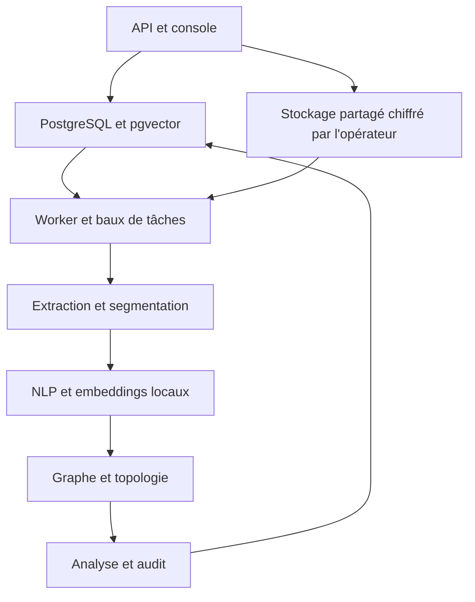

# Mass Classification

Plateforme Python d’ingestion, de classification et d’exploration de pièces volumineuses, orientée données bancaires et enquêtes. Les résultats relient les signaux à des documents et restent soumis à une **revue humaine**. Aucun score heuristique ne constitue une probabilité de fraude, une preuve d’intention ou une conclusion policière.

Le [guide fourni](GUIDE_CONSTRUCTION_PLATEFORME_COMPLETE.md) décrit des techniques confirmées, proposées et hypothétiques. Ce dépôt en transforme une partie en code exploitable et **identifie explicitement les composants dépendant de données, de validation ou d’infrastructure**. Il n’annonce pas une performance de 10 millions de documents sans essai de charge.

## Essayer l’interface en local

Le mode découverte ouvre une vraie interface et fournit trois documents **entièrement fictifs**. Il fonctionne avec une base SQLite locale, sans Docker, clé API, PostgreSQL ni téléchargement de modèle :

```bash
python -m pip install -r requirements-demo.txt
python -m mass_classification.demo
```

Ouvrir ensuite **http://127.0.0.1:8000/** dans le navigateur. Aucun compte n’est demandé dans ce mode ; le serveur n’écoute que sur `127.0.0.1`. Pour changer de port : `python -m mass_classification.demo --port 8080`.

Depuis l’écran d’accueil, ouvrir une pièce d’exemple, rechercher `virement Nova`, suivre un lien dans **Relations**, puis enregistrer une revue. On peut aussi importer un fichier UTF-8 `.txt`, `.md`, `.csv`, `.tsv`, `.json` ou `.eml` de 5 Mio maximum et télécharger CSV/PDF. Les imports et revues restent dans `.mass-demo/demo.sqlite3` sur cette machine. Pour repartir des exemples initiaux, arrêter le serveur puis supprimer le dossier `.mass-demo` ; cela efface aussi les imports et revues locaux.

**Portée du mode découverte :** l’import est traité immédiatement, la recherche est lexicale et les thèmes sont suggérés par des règles simples. Il ne lance ni les modèles d’embeddings, ni l’OCR, ni la transcription, ni le réseau neuronal de la plateforme complète. La bannière ambre de l’interface rappelle cette différence. Pour tester le pipeline complet avec vos propres pièces, suivre le démarrage Docker ci-dessous.

## Démarrage

Pré-requis : Docker avec Compose, une machine disposant d’espace disque pour les modèles, Tesseract et FFmpeg fournis par l’image. Déploiement derrière un proxy TLS configuré par l’opérateur.

```bash
cp .env.example .env
# Modifier POSTGRES_PASSWORD et la même valeur dans DATABASE_URL ; choisir ALLOWED_ORIGINS.
docker compose build
docker compose up -d db redis
docker compose run --rm api python -m mass_classification.admin create-key --tenant default --role admin
# Conserver la clé affichée une seule fois dans un coffre de secrets.
docker compose up -d api worker
curl http://127.0.0.1:8000/health/ready
```

Interface locale : `http://127.0.0.1:8000/`. Documentation API interactive : `/docs`. La branche de production ne doit être exposée qu’à travers HTTPS. Le premier lancement peut télécharger le modèle de phrases et le modèle de transcription si aucun cache local n’est préchargé. En environnement isolé, précharger les modèles approuvés dans les volumes avant l’ouverture des services, configurer leurs chemins et bloquer toute sortie réseau au niveau du réseau d’exécution.

Exemple d’import, de consultation et de recherche :

```bash
export MASS_API_KEY='mc_...'
curl -H "Authorization: Bearer $MASS_API_KEY" -F file=@exemple.txt -F 'source_json={"case":"D-17"}' http://127.0.0.1:8000/v1/documents
curl -H "Authorization: Bearer $MASS_API_KEY" http://127.0.0.1:8000/v1/documents
curl -H "Authorization: Bearer $MASS_API_KEY" -H 'Content-Type: application/json' -d '{"query":"virement inhabituel"}' http://127.0.0.1:8000/v1/ask
```

L’API répond `202` à l’import ; le worker publie ensuite `queued`, `processing`, `ready` ou `failed`. Rejouer un même fichier dans un tenant renvoie l’ID existant. Les questions restituent des **extraits** et des IDs de pièces, sans génération libre.

## Architecture et chemin d’une pièce



- **Ingestion** : flux HTTP limité à 50 Mio, SHA-256, noms de fichier neutralisés, copie sur volume par tenant, tâche persistée ; les doublons sont dédupliqués dans le tenant.
- **Extraction** : texte/code/HTML/CSV/JSON/XML/YAML, PDF avec OCR de repli, images avec OCR et métadonnées, DOCX, XLSX, EML, MSG, ZIP borné, audio avec Whisper local, vidéo avec FFmpeg, échantillonnage d’images et transcription. Extraction sans ouverture des liens contenus dans la pièce. La reconnaissance faciale et l’extraction fiable de schémas graphiques ne sont pas implémentées.
- **Analyse** : détection de langue et d’entités spaCy, montants, relations par règles sourcées, sentiment VADER **uniquement pour l’anglais**, statistiques lexicales, priorité de revue par règles. Des fonctions isolées calculent anomalies robustes et coïncidences temporelles ; elles ne sont pas invoquées sur des événements dépourvus de provenance temporelle.
- **Vecteurs** : modèle multilingue local de 384 dimensions, segments chevauchants, recherche par distance cosinus pgvector, au plus 500 segments indexés par pièce. L’indicateur `embedding_truncated` signale la coupure. Les entités sont normalisées par type et nom exact ; aucune fusion floue automatique.
- **Graphe** : entités, mentions et relations extraites de passages précis. Les statistiques de topologie utilisent les **relations extraites par règles**, limitées à 20 entités par document ; ces arêtes restent des indices à examiner, sans conclusion automatique. Incidences orientées, triangles, composantes, cycles du graphe et homologie persistante GUDHI bornée.
- **Réseau topologique** : deux couches de messages entre nœuds, arêtes et faces, attention, tête de classes et tête de score. Les poids ne sont utilisés que si un point de contrôle `approved.pt` a été placé par l’opérateur et accompagné de `approved.json`. Sans poids entraînés/validés, `predictions.status=unavailable` ; aucun score neural inventé.
- **Sortie** : REST, tableau de bord responsive, recherche extractive avec citations, journal d’accès et de revue, export CSV/PDF. Application installable avec **coque hors ligne uniquement** ; les données d’enquête ne sont jamais mises en cache dans le navigateur par le service worker.

## API et rôles

| Route | Rôle | Usage |
| --- | --- | --- |
| `POST /v1/documents` | admin, analyst | importer et mettre en file |
| `GET /v1/documents`, `GET /v1/documents/{id}` | tous | lister, lire une pièce et ses analyses |
| `POST /v1/search`, `POST /v1/ask` | tous | chercher des passages et obtenir des citations |
| `GET /v1/graph` | tous | voir les relations attestées par passage |
| `POST /v1/documents/{id}/feedback` | admin, analyst | enregistrer une revue |
| `GET /v1/exports/documents.csv`, `GET /v1/documents/{id}/report.pdf` | admin, analyst | exporter |
| `GET /v1/audit`, `GET /metrics` | admin | journal et métriques |
| `GET /v1/monitoring` | admin | statuts, backlog, versions, retours humains |
| `GET /health/live`, `GET /health/ready` | public interne | sondes |

Les clés sont générées en CLI, stockées sous empreinte SHA-256, liées à un tenant et révocables via `python -m mass_classification.admin revoke-key --key-id UUID`. Toutes les lectures et mutations applicatives filtrent par `tenant_id`. Les limites par clé passent par Redis et échouent fermées si Redis ne répond pas. Les clés d’API, le trafic TLS et les volumes chiffrés dépendent de la configuration de l’opérateur. Les comptes de base de données ne sont jamais confiés aux utilisateurs finaux.

## Connecteurs

La CLI `mass-connector` supporte `files`, `rss`, `s3`, `sql` (SELECT configuré par opérateur), `mongodb`, `sftp` (clé et hôte connus) et `kafka`. Exemple :

```json
{"kind":"files","directory":"/data/import","glob":"*.csv"}
```

```bash
MASS_API_KEY='mc_...' mass-connector --config connector.json --api https://mass.example.org
```

L’API HTTP sert également à une intégration autorisée avec un fournisseur de réseaux sociaux ou de stockage. La collecte de Twitter/X, Reddit ou de flux propriétaires nécessite un connecteur autorisé et les droits correspondants ; ce dépôt ne prétend pas disposer d’un accès universel à ces données. Les événements Kafka sont validés par l’API avant validation de l’offset. Déployer le connecteur via votre ordonnanceur et maintenir ses marqueurs de progression externes pour les sources par interrogation.

## Modèles et validation

Le script `mass-train --dataset cases.npz --output /var/lib/mass/models/candidate.pt --classes banking media other` entraîne un modèle topologique sur des **graphes de cas annotés par des personnes**. Chaque objet `samples` du NPZ contient `nodes` (N × 384), `b1` (N × E), `b2` (E × F), `label` (indice de classe) et `risk` (cible entre 0 et 1). L’entraînement exige au moins 20 cas, sépare 80/20 et écrit une précision de validation. Un jeu de 20 cas ne suffit pas à autoriser l’usage opérationnel ; effectuer validation indépendante, calibration, dérive et revue juridique avant de renommer les sorties en `approved.pt` et `approved.json`. Charger uniquement des NPZ préparés par l’équipe d’exploitation : ce format peut contenir des objets Python.

Les règles `rules:v1` sont une base explicable, pas un classificateur supervisé. La résolution de coréférence, l’extraction neuronale de relations, les embeddings de graphe entraînés, SHAP, la prévision d’action et les classes fraude/crédibilité **ne sont pas validées** en l’absence de corpus annoté et de vérité terrain. L’attention d’un réseau n’établit pas une cause. Conserver dans les rapports la version du modèle, les limitations et l’élément de preuve.

Pour adapter les embeddings à un tenant, préparer un TSV `text_a<TAB>text_b<TAB>similarity` (en-tête inclus), puis exécuter `mass-tune-embeddings --pairs paires.tsv --base-model <modele-local> --output /var/lib/mass/models/tenant-v2`. L’évaluation utilise 20 % de paires retenues. Mettre ensuite `EMBEDDING_MODEL` sur le chemin validé et **réindexer tous les segments du tenant** avant toute recherche, faute de quoi la comparaison de vecteurs issus de deux modèles n’a aucun sens. Un outil de réindexation en ligne avec bascule atomique reste à fournir.

## Exploitation et sécurité

1. Publier l’image immuable via CI, analyser les dépendances et figer les versions/digests lors de la promotion ; le `pyproject.toml` utilise actuellement des bornes de versions, pas un verrou reproductible.
2. Déployer PostgreSQL/pgvector, Redis, stockage partagé, modèle approuvé, secrets, certificat TLS et politiques réseau. Compose fournit un environnement mono-hôte ; `deploy/k8s/mass.yaml` montre le déploiement API/worker sur volumes RWX et attend des services PostgreSQL/Redis gérés et des secrets externes.
3. Chiffrer les volumes et les sauvegardes au niveau de l’infrastructure. Sauvegarder PostgreSQL **et** le volume de pièces au même point de cohérence, tester la restauration et définir rétention/suppression selon le dossier. Le journal SQL est traçable mais non immuable face à l’administrateur DB ; exporter les événements vers un journal append-only si la chaîne de conservation l’exige.
4. Placer le proxy HTTPS devant l’API ; limiter les accès à `/docs`, `/metrics` et aux sondes selon votre réseau. Superviser la profondeur des tâches, les erreurs, les délais de traitement et les métriques Prometheus. Un worker reprend les baux expirés, jusqu’à trois essais avec délai croissant.
5. À grande échelle, créer après chargement un index par tenant/partition adapté : `CREATE INDEX CONCURRENTLY ... USING hnsw (embedding vector_cosine_ops)` sur `chunks`. Le filtre par tenant peut dégrader le rappel ANN : vérifier plan SQL, rappel et isolation avant l’activation. Partitionnement, bascule de base, stockage objet et tests de charge sont à dimensionner sur vos données.

L’application ne télécharge aucun modèle à l’exécution si les caches locaux ont été préchargés. Des poids manquants ou incompatibles ne sont jamais remplacés par une prédiction synthétique. Les vidéos et transcriptions consomment beaucoup de CPU : limiter leur volume et allouer des workers distincts selon la charge. Pour les données bancaires et d’enquête, éviter les comptes partagés, documenter les durées de conservation et faire approuver les traitements de données sensibles.

## Vérification

```bash
python -m pip install -e '.[test,topology]'
python -m compileall -q mass_classification
python -m pytest -q
docker compose build
```

Les tests unitaires vérifient extraction sûre, complexité bornée, incidence simpliciale, homologie d’un triangle, anomalies, règles et auth. Un essai de bout en bout exige PostgreSQL, Redis, modèles téléchargés, OCR et image Docker. Le pipeline CI construit l’image et exécute les tests ; il ne simule pas 10 M de pièces.

## Couverture du guide et limites de cette livraison

| Thème du guide | Réalisé | Prérequis ou travail restant avant une mise en production réglementée |
| --- | --- | --- |
| Formats texte, image, audio, vidéo | extraction et garde-fous, OCR/ASR locaux | formats rares, flux vidéo continu, validation de qualité OCR et reconnaissance faciale selon cadre légal |
| Connecteurs et flux | CLI fichiers/RSS/S3/SQL/Mongo/SFTP/Kafka ; API | points de reprise pour polling, intégrations propriétaires et permissions |
| NLP, relations, signaux | spaCy, règles, langue, sentiment anglais, anomalies temporelles utilitaires | corpus métier et extraction neuronale, coréférence, géolocalisation fiable |
| Embeddings et graphe | phrase multilingue, indexation, mentions, relations, topologie | fine tuning par tenant, désambiguïsation supervisée, graphe distribué |
| TNN et prédictions | architecture et entraînement hors ligne ; absence de poids signalée | corpus labellisé suffisant, calibration, validation indépendante, promotion du modèle |
| Interprétabilité | règles, passages et provenance, scores détaillés, attention disponible si modèle | SHAP sur modèle validé, comparables historiques autorisés, contrôle de dérive |
| API, interface, export, audit | service et console responsive, CSV/PDF, revue et journal | journal inviolable, politique de rétention, fédération SSO, reportings approfondis |
| Résilience et échelle | tâches SQL avec bail, retry, Docker, référence Kubernetes | bascule/backup gérés, partitions/ANN, supervision SLA, essais de charge |
| Mobile et hors ligne | interface responsive et coque PWA | analyse de pièces hors ligne et application mobile native |

Les estimations de coût, latence, capacité et qualité du guide sont des **hypothèses**, non des résultats mesurés pour ce dépôt.

## Licence et contribution

Voir [LICENSE](../LICENSE). Proposer des tests sur données synthétiques ; ne jamais committer de données bancaires, dossiers d’enquête, clés, checkpoints non autorisés ni fichiers `.env`.
